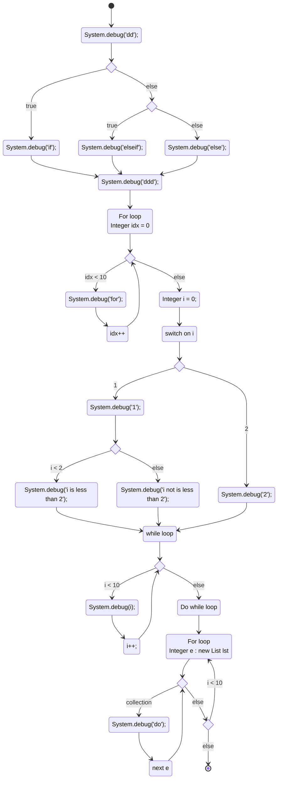
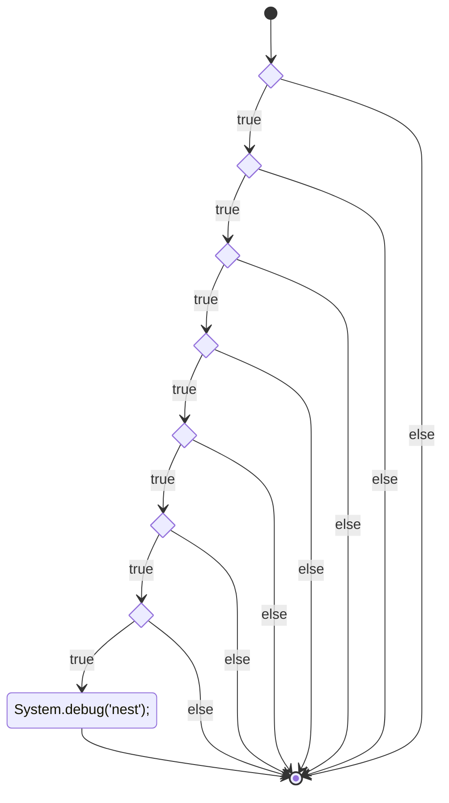
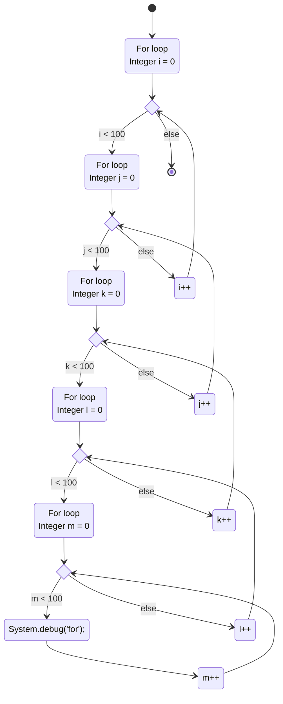
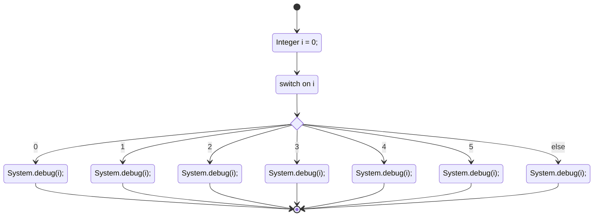
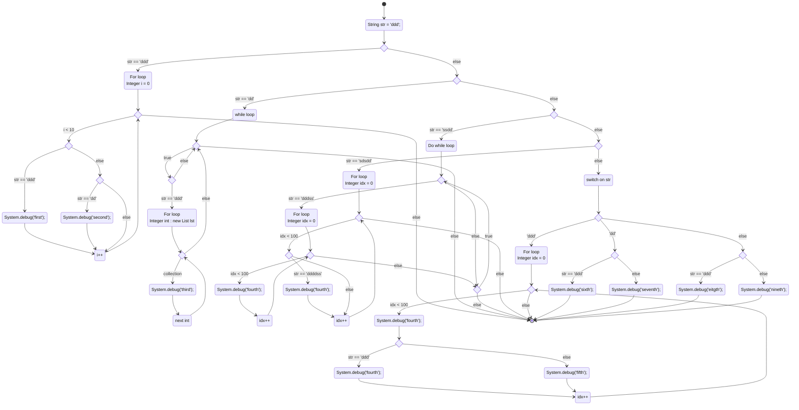

# @shuntaro/sfdx-apex-doc

[](https://www.npmjs.com/package/@shuntaro/sfdx-apex-doc) [](https://npmjs.org/package/@shuntaro/sfdx-apex-doc) [](https://raw.githubusercontent.com/salesforcecli/@shuntaro/sfdx-apex-doc/main/LICENSE.txt)

<!--
## Using the template

This repository provides a template for creating a plugin for the Salesforce CLI. To convert this template to a working plugin:

1. Please get in touch with the Platform CLI team. We want to help you develop your plugin.
2. Generate your plugin:

   ```
   sf plugins install dev
   sf dev generate plugin

   git init -b main
   git add . && git commit -m "chore: initial commit"
   ```

3. Create your plugin's repo in the salesforcecli github org
4. When you're ready, replace the contents of this README with the information you want.

## Learn about `sf` plugins

Salesforce CLI plugins are based on the [oclif plugin framework](<(https://oclif.io/docs/introduction.html)>). Read the [plugin developer guide](https://developer.salesforce.com/docs/atlas.en-us.sfdx_cli_plugins.meta/sfdx_cli_plugins/cli_plugins_architecture_sf_cli.htm) to learn about Salesforce CLI plugin development.

This repository contains a lot of additional scripts and tools to help with general Salesforce node development and enforce coding standards. You should familiarize yourself with some of the [node developer packages](#tooling) used by Salesforce.

Additionally, there are some additional tests that the Salesforce CLI will enforce if this plugin is ever bundled with the CLI. These test are included by default under the `posttest` script and it is required to keep these tests active in your plugin if you plan to have it bundled.

### Tooling

- [@salesforce/core](https://github.com/forcedotcom/sfdx-core)
- [@salesforce/kit](https://github.com/forcedotcom/kit)
- [@salesforce/sf-plugins-core](https://github.com/salesforcecli/sf-plugins-core)
- [@salesforce/ts-types](https://github.com/forcedotcom/ts-types)
- [@salesforce/ts-sinon](https://github.com/forcedotcom/ts-sinon)
- [@salesforce/dev-config](https://github.com/forcedotcom/dev-config)
- [@salesforce/dev-scripts](https://github.com/forcedotcom/dev-scripts)

### Hooks

For cross clouds commands, e.g. `sf env list`, we utilize [oclif hooks](https://oclif.io/docs/hooks) to get the relevant information from installed plugins.

This plugin includes sample hooks in the [src/hooks directory](src/hooks). You'll just need to add the appropriate logic. You can also delete any of the hooks if they aren't required for your plugin.

# Everything past here is only a suggestion as to what should be in your specific plugin's description

This plugin is bundled with the [Salesforce CLI](https://developer.salesforce.com/tools/sfdxcli). For more information on the CLI, read the [getting started guide](https://developer.salesforce.com/docs/atlas.en-us.sfdx_setup.meta/sfdx_setup/sfdx_setup_intro.htm).

We always recommend using the latest version of these commands bundled with the CLI, however, you can install a specific version or tag if needed.

-->

## Install

```bash
sf plugins install @shuntaro/sfdx-apex-doc@x.y.z
```

## Issues

Please report any issues at https://github.com/forcedotcom/cli/issues

## Contributing

1. Please read our [Code of Conduct](CODE_OF_CONDUCT.md)
2. Create a new issue before starting your project so that we can keep track of
   what you are trying to add/fix. That way, we can also offer suggestions or
   let you know if there is already an effort in progress.
3. Fork this repository.
4. [Build the plugin locally](#build)
5. Create a _topic_ branch in your fork. Note, this step is recommended but technically not required if contributing using a fork.
6. Edit the code in your fork.
7. Write appropriate tests for your changes. Try to achieve at least 95% code coverage on any new code. No pull request will be accepted without unit tests.
8. Sign CLA (see [CLA](#cla) below).
9. Send us a pull request when you are done. We'll review your code, suggest any needed changes, and merge it in.

### CLA

External contributors will be required to sign a Contributor's License
Agreement. You can do so by going to https://cla.salesforce.com/sign-cla.

### Build

To build the plugin locally, make sure to have yarn installed and run the following commands:

```bash
# Clone the repository
git clone git@github.com:salesforcecli/@shuntaro/sfdx-apex-doc

# Install the dependencies and compile
yarn && yarn build
```

To use your plugin, run using the local `./bin/dev` or `./bin/dev.cmd` file.

```bash
# Run using local run file.
./bin/dev hello generate
```

There should be no differences when running via the Salesforce CLI or using the local run file. However, it can be useful to link the plugin to do some additional testing or run your commands from anywhere on your machine.

```bash
# Link your plugin to the sf cli
sf plugins link .
# To verify
sf plugins
```

## Commands

<!-- commands -->

- [`sf apexdoc doc generate`](#sf-apexdoc-doc-generate)
- [`sf apexdoc flowdiagram generate`](#sf-apexdoc-flowdiagram-generate)

## `sf apexdoc doc generate`

Generates Apex doc to READ.md.

```
USAGE
  $ sf apexdoc doc generate -i <value> -o <value> [--json] [-d <value>] [-u <value>] [-v <value>]

FLAGS
  -d, --docsdir=<value>     [default: docs] directory that Apex documentation markdown files are saved in.
  -i, --inputdir=<value>    (required) input directory that apex classes are stored in.
  -o, --outputdir=<value>   (required) output directory that includes README.md.
  -u, --repourl=<value>     repository url that includes README.md and outputdir to save Apex documentations.
  -v, --releasever=<value>  release version of repository.

GLOBAL FLAGS
  --json  Format output as json.

DESCRIPTION
  Generates Apex doc to READ.md.

  Generates Apex doc in the Apex Developer document format to READ.md.

EXAMPLES
  Generates Apex doc to README.md:

    $ sfdx apexdoc:generate -i <inputdirecroy> -o <outputdirecroy>
```

## `sf apexdoc flowdiagram generate`

Generates Apex doc to READ.md.

```
USAGE
  $ sf apexdoc flowdiagram generate -i <value> -o <value> [--json]

FLAGS
  -i, --inputdir=<value>   (required) input directory that apex classes are stored in.
  -o, --outputdir=<value>  (required) output directory that includes README.md.

GLOBAL FLAGS
  --json  Format output as json.

DESCRIPTION
  Generates Apex doc to READ.md.

  Generates Apex doc in the Apex Developer document format to READ.md.

EXAMPLES
  Generates Apex flow diagram built with mermaid statement-v:

    $ sfdx apexdoc:flowdiagram:generate -i <inputdirecroy> -o <outputdirecroy>
```

<!-- commandsstop -->

# Example

## sf apexdoc doc generate

The example of formatting the following apex class: DynamicDao.cls.

```apex
public inherited sharing class DynamicDao {
  private System.Type sObjectType;

  private static final String SELECT_STRING = 'SELECT ';
  private static final String FROM_STRING = ' FROM ';
  private static final String WHERE_STRING = ' WHERE ';
  private static final String WITH_STRING = ' WITH ';
  private static final String GROUP_STRING = ' GROUP BY ';
  private static final String ORDER_STRING = ' ORDER BY ';
  private static final String LIMIT_STRING = ' LIMIT ';
  private static final String OFFSET_STRING = ' OFFSET ';
  private static final String FOR_VIEW_STRING = ' FOR VIEW ';
  private static final String FOR_REFERENCE_STRING = ' FOR REFERENCE ';
  private static final String UPDATE_STRING = ' UPDATE ';
  private static final String FOR_UPDATE_STRING = ' FOR UPDATE ';
  private static final String COUNT_STRING = ' COUNT() ';

  /**
   * @description Constructor providing object type.
   * @param sObjectType SObject type.
   */
  public DynamicDao(System.Type sObjectType) {
    if (Schema.getGlobalDescribe().get(sObjectType.toString()) == null) {
      throw new ExceptionMessage.CustomException(ExceptionMessage.MESSAGES.get('dynamicDaoNotFoundSObject'));
    }
    this.sObjectType = sObjectType;
  }

  /**
   * @description Gets the records of sObjectType.
   * @param soqlQueryClause SoqlQueryClause object to be converted to a soql query string when extracting records.
   * @return List of sObjectType class.
   * @example
   */
  public List<SObject> getSelfSObjectRecords(SoqlQueryClause soqlQueryClause) {
    List<SObject> recordList = new List<SObject>();

    validatesSoqlClaseForSelfDml(soqlQueryClause);

    String queryStr = getSoqlQuery(soqlQueryClause, false);
    recordList = Database.query(queryStr);
    return recordList;
  }
}
```

The `apexdoc:generate` formats the above class to the following markdown and insert the markdown script into `<usage>` tag on the existing README.md:

### DynamicDao

Constructor providing object type.

```apex
SIGNATURE


public DynamicDao(System.Type sObjectType)

PARAMETERS

  sObjectType

    Description: sObjectType SObject type.

    Type: System.Type

RETURN VALUE


```

### getSelfSObjectRecords

Gets the records of sObjectType.

```apex
SIGNATURE


public List<SObject> getSelfSObjectRecords(SoqlQueryClause soqlQueryClause)

PARAMETERS

  soqlQueryClause

    Description: soqlQueryClause SoqlQueryClause object to be converted to a soql query string when extracting records.

    Type: SoqlQueryClause

RETURN VALUE

  List<SObject>
```

# sf apexdoc flowdiagram generate`

This command is in development not tested out at all! Thefore, we cannot ensure everything works fine.

the command creates flow-diagram built with mermaid-stateDiagram-v2. An example of producing the following Apex classe's flow diagram:

```apex
public inherited sharing class NoneMethods {
  public void method() {
    System.debug('dd');
    if (true) {
      System.debug('if');
    } else if (true) {
      System.debug('elseif');
    } else {
      System.debug('else');
    }
    System.debug('ddd');
    for (Integer idx = 0; idx < 10; idx++) {
      System.debug('for');
    }
    Integer i = 0;
    switch on i {
      when 1 {
        System.debug('1');
        if (i < 2) {
          System.debug('i is less than 2');
        } else {
          System.debug('i not is less than 2');
        }
      }
      when 2 {
        System.debug('2');
      }
    }
    while (i < 10) {
      System.debug(i);
      i++;
    }
    do {
      for (Integer e : new List<Integer> lst) {
        System.debug('do');
      }
    } while (i < 10)
  }
}
```

The output diagram:



The example of if statements:

```apex
public void nests() {
  if (true) {
    if (true) {
      if (true) {
        if (true) {
          if (true) {
            if (true) {
              if (true) {
                System.debug('nest');
              }
            }
          }
        }
      }
    }
  }
}
```



The example of for statements:

```apex
public void fors() {
  for (Integer i = 0; i < 100; i++) {
    for (Integer j = 0; j < 100; j++) {
      for (Integer k = 0; k < 100; k++) {
        for (Integer l = 0; l < 100; l++) {
          for (Integer m = 0; m < 100; m++) {
            System.debug('for');
          }
        }
      }
    }
  }
}
```



The example of switch statements:

```apex
public void switches(){
  Integer i = 0;
  switch on i {
    when 0 {
      System.debug(i);
    }
    when 1 {
      System.debug(i);
    }
    when 2 {
      System.debug(i);
    }
    when 3 {
      System.debug(i);
    }
    when 4 {
      System.debug(i);
    }
    when 5 {
      System.debug(i);
    }
    when else {
      System.debug(i);
    }
  }
}
```



Super nests:

```apex
public void superNests(){
  String str = 'ddd';
  if (str == 'ddd') {
    for (Integer i = 0; i < 10; i++) {
      if (str == 'ddd') {
        System.debug('first');
      } else if (str == 'dd') {
        System.debug('second');
      }
    }
  } else if (str == 'dd') {
    while (true) {
      if (str == 'ddd') {
        for (Integer int : new List<Integer> lst) {
          System.debug('third');
        }
      }
    }
  } else if (str == 'ssdd') {
    do {
      if (str == 'dddss') {
        for (Integer idx = 0; idx < 100; idx++) {
          System.debug('fourth');
        }
      }
    } while (true);
  } else if (str == 'sdsdd') {
    for (Integer idx = 0; idx < 100; idx++) {
      if (str == 'ddddss') {
        System.debug('fourth');
      }
    }
  } else {
    switch on str {
      when 'ddd' {
        for (Integer idx = 0; idx < 100; idx++) {
          System.debug('fourth');
          if (str == 'ddd') {
            System.debug('fourth');
          } else {
            System.debug('fifth');
          }
        }
      }
      when 'dd' {
        if (str == 'ddd') {
          System.debug('sixth');
        } else {
          System.debug('seventh');
        }
      }
      when else {
        if (str == 'ddd') {
          System.debug('eitgth');
        } else {
          System.debug('nineth');
        }
      }
    }
  }
}
```


