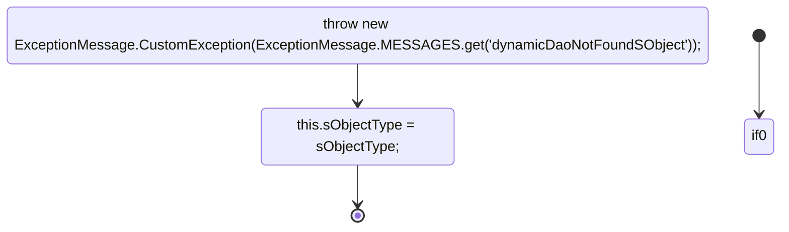

```mermaid
stateDiagram-v2
state "
      throw new ExceptionMessage.CustomException(ExceptionMessage.MESSAGES.get('dynamicDaoNotFoundSObject'));" as ex0
state "
    this.sObjectType = sObjectType;" as ex1
[*] --> if0
ex0 --> ex1
ex1 --> [*]
```
