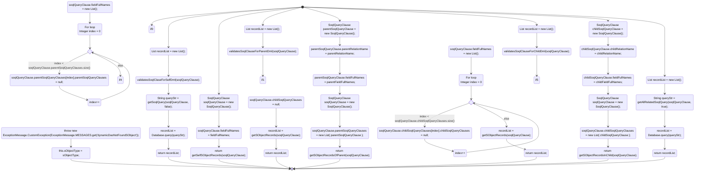

```mermaid
stateDiagram-v2
state "
      throw new ExceptionMessage.CustomException(ExceptionMessage.MESSAGES.get('dynamicDaoNotFoundSObject'));" as ex0
state "
    this.sObjectType = sObjectType;" as ex1
state "
    List<SObject> recordList = new List<SObject>();" as ex2
state "

    validatesSoqlClaseForSelfDml(soqlQueryClause);" as ex3
state "

    String queryStr = getSoqlQuery(soqlQueryClause, false);" as ex4
state "
    recordList = Database.query(queryStr);" as ex5
state "
    return recordList;" as ex6
state "
    SoqlQueryClause soqlQueryClause = new SoqlQueryClause();" as ex7
state "
    soqlQueryClause.fieldFullNames = fieldFullNames;" as ex8
state "
    return getSelfSObjectRecords(soqlQueryClause);" as ex9
state "
    List<SObject> recordList = new List<SObject>();" as ex10
state "

    validatesSoqlClauseForParentDml(soqlQueryClause);" as ex11
state "
      soqlQueryClause.fieldFullNames = new List<String>();" as ex12
state "For loop
Integer index = 0" as for0
state if2 <<choice>>
state "
      soqlQueryClause.parentSoqlQueryClauses[index].parentSoqlQueryClauses = null;" as ex13
state " index++" as ex14
state "
      soqlQueryClause.childSoqlQueryClauses = null;" as ex15
state "
    recordList = getSObjectRecords(soqlQueryClause);" as ex16
state "
    return recordList;" as ex17
state "
    SoqlQueryClause parentSoqlQueryClause = new SoqlQueryClause();" as ex18
state "
    parentSoqlQueryClause.parentRelationName = parentRelationName;" as ex19
state "
    parentSoqlQueryClause.fieldFullNames = parentFieldFullNames;" as ex20
state "
    SoqlQueryClause soqlQueryClause = new SoqlQueryClause();" as ex21
state "
    soqlQueryClause.parentSoqlQueryClauses = new List<SoqlQueryClause>{ parentSoqlQueryClause };" as ex22
state "
    return getSObjectRecordsOfParent(soqlQueryClause);" as ex23
state "
    List<SObject> recordList = new List<SObject>();" as ex24
state "

    validatesSoqlClauseForChildDml(soqlQueryClause);" as ex25
state "
      soqlQueryClause.fieldFullNames = new List<String>();" as ex26
state "For loop
Integer index = 0" as for1
state if6 <<choice>>
state "
      soqlQueryClause.childSoqlQueryClauses[index].childSoqlQueryClauses = null;" as ex27
state " index++" as ex28
state "
    recordList = getSObjectRecords(soqlQueryClause);" as ex29
state "
    return recordList;" as ex30
state "
    SoqlQueryClause childSoqlQueryClause = new SoqlQueryClause();" as ex31
state "
    childSoqlQueryClause.childRelationName = childRelationName;" as ex32
state "
    childSoqlQueryClause.fieldFullNames = childFieldFullNames;" as ex33
state "
    SoqlQueryClause soqlQueryClause = new SoqlQueryClause();" as ex34
state "
    soqlQueryClause.childSoqlQueryClauses = new List<SoqlQueryClause>{ childSoqlQueryClause };" as ex35
state "
    return getSObjectRecordsInChild(soqlQueryClause);" as ex36
state "
    List<SObject> recordList = new List<SObject>();" as ex37
state "

    String queryStr = getAllRelatedSoqlQuery(soqlQueryClause, true);" as ex38
state "
    recordList = Database.query(queryStr);" as ex39
state "
    return recordList;" as ex40
[*] --> if0
ex0 --> ex1
ex1 --> [*]
[*] --> ex2
ex2 --> ex3
ex3 --> ex4
ex4 --> ex5
ex5 --> ex6
ex6 --> [*]
[*] --> ex7
ex7 --> ex8
ex8 --> ex9
ex9 --> [*]
[*] --> ex10
ex10 --> ex11
ex11 --> if1
ex12 --> for0
for0 --> if2
if2 --> ex13 :  index < soqlQueryClause.parentSoqlQueryClauses.size()
if2 --> if4 : else
ex13 --> ex14
ex14 --> if2
ex15 --> ex16
ex16 --> ex17
ex17 --> [*]
[*] --> ex18
ex18 --> ex19
ex19 --> ex20
ex20 --> ex21
ex21 --> ex22
ex22 --> ex23
ex23 --> [*]
[*] --> ex24
ex24 --> ex25
ex25 --> if5
ex26 --> for1
for1 --> if6
if6 --> ex27 :  index < soqlQueryClause.childSoqlQueryClauses.size()
if6 --> ex29 : else
ex27 --> ex28
ex28 --> if6
ex29 --> ex30
ex30 --> [*]
[*] --> ex31
ex31 --> ex32
ex32 --> ex33
ex33 --> ex34
ex34 --> ex35
ex35 --> ex36
ex36 --> [*]
[*] --> ex37
ex37 --> ex38
ex38 --> ex39
ex39 --> ex40
ex40 --> [*]
```
