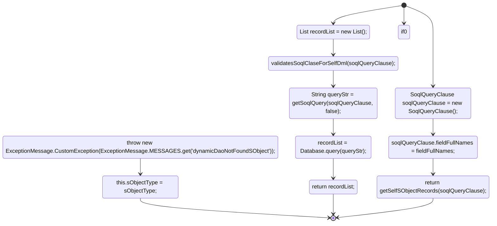

```mermaid
stateDiagram-v2
state "
      throw new ExceptionMessage.CustomException(ExceptionMessage.MESSAGES.get('dynamicDaoNotFoundSObject'));" as ex0
state "
    this.sObjectType = sObjectType;" as ex1
state "
    List<SObject> recordList = new List<SObject>();" as ex2
state "

    validatesSoqlClaseForSelfDml(soqlQueryClause);" as ex3
state "

    String queryStr = getSoqlQuery(soqlQueryClause, false);" as ex4
state "
    recordList = Database.query(queryStr);" as ex5
state "
    return recordList;" as ex6
state "
    SoqlQueryClause soqlQueryClause = new SoqlQueryClause();" as ex7
state "
    soqlQueryClause.fieldFullNames = fieldFullNames;" as ex8
state "
    return getSelfSObjectRecords(soqlQueryClause);" as ex9
[*] --> if0
ex0 --> ex1
ex1 --> [*]
[*] --> ex2
ex2 --> ex3
ex3 --> ex4
ex4 --> ex5
ex5 --> ex6
ex6 --> [*]
[*] --> ex7
ex7 --> ex8
ex8 --> ex9
ex9 --> [*]
```
