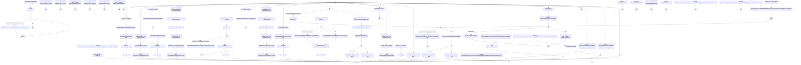

```mermaid
stateDiagram-v2
state "
      throw new ExceptionMessage.CustomException(ExceptionMessage.MESSAGES.get('dynamicDaoNotFoundSObject'));" as ex0
state "
    this.sObjectType = sObjectType;" as ex1
state "
    List<SObject> recordList = new List<SObject>();" as ex2
state "

    validatesSoqlClaseForSelfDml(soqlQueryClause);" as ex3
state "

    String queryStr = getSoqlQuery(soqlQueryClause, false);" as ex4
state "
    recordList = Database.query(queryStr);" as ex5
state "
    return recordList;" as ex6
state "
    SoqlQueryClause soqlQueryClause = new SoqlQueryClause();" as ex7
state "
    soqlQueryClause.fieldFullNames = fieldFullNames;" as ex8
state "
    return getSelfSObjectRecords(soqlQueryClause);" as ex9
state "
    List<SObject> recordList = new List<SObject>();" as ex10
state "

    validatesSoqlClauseForParentDml(soqlQueryClause);" as ex11
state "
      soqlQueryClause.fieldFullNames = new List<String>();" as ex12
state "For loop
Integer index = 0" as for0
state if2 <<choice>>
state "
      soqlQueryClause.parentSoqlQueryClauses[index].parentSoqlQueryClauses = null;" as ex13
state " index++" as ex14
state "
      soqlQueryClause.childSoqlQueryClauses = null;" as ex15
state "
    recordList = getSObjectRecords(soqlQueryClause);" as ex16
state "
    return recordList;" as ex17
state "
    SoqlQueryClause parentSoqlQueryClause = new SoqlQueryClause();" as ex18
state "
    parentSoqlQueryClause.parentRelationName = parentRelationName;" as ex19
state "
    parentSoqlQueryClause.fieldFullNames = parentFieldFullNames;" as ex20
state "
    SoqlQueryClause soqlQueryClause = new SoqlQueryClause();" as ex21
state "
    soqlQueryClause.parentSoqlQueryClauses = new List<SoqlQueryClause>{ parentSoqlQueryClause };" as ex22
state "
    return getSObjectRecordsOfParent(soqlQueryClause);" as ex23
state "
    List<SObject> recordList = new List<SObject>();" as ex24
state "

    validatesSoqlClauseForChildDml(soqlQueryClause);" as ex25
state "
      soqlQueryClause.fieldFullNames = new List<String>();" as ex26
state "For loop
Integer index = 0" as for1
state if6 <<choice>>
state "
      soqlQueryClause.childSoqlQueryClauses[index].childSoqlQueryClauses = null;" as ex27
state " index++" as ex28
state "
    recordList = getSObjectRecords(soqlQueryClause);" as ex29
state "
    return recordList;" as ex30
state "
    SoqlQueryClause childSoqlQueryClause = new SoqlQueryClause();" as ex31
state "
    childSoqlQueryClause.childRelationName = childRelationName;" as ex32
state "
    childSoqlQueryClause.fieldFullNames = childFieldFullNames;" as ex33
state "
    SoqlQueryClause soqlQueryClause = new SoqlQueryClause();" as ex34
state "
    soqlQueryClause.childSoqlQueryClauses = new List<SoqlQueryClause>{ childSoqlQueryClause };" as ex35
state "
    return getSObjectRecordsInChild(soqlQueryClause);" as ex36
state "
    List<SObject> recordList = new List<SObject>();" as ex37
state "

    String queryStr = getAllRelatedSoqlQuery(soqlQueryClause, true);" as ex38
state "
    recordList = Database.query(queryStr);" as ex39
state "
    return recordList;" as ex40
state if8 <<choice>>
state "For loop
Integer index = 0" as for2
state if9 <<choice>>
state "
        String childSubQueryStr = getSoqlQuery(soqlQueryClause.childSoqlQueryClauses[index], true);" as ex41
state "
          soqlQueryClause.fieldFullNames = new List<String>();" as ex42
state "
        soqlQueryClause.fieldFullNames.add(getAllRelatedSoqlQuery(soqlQueryClause.childSoqlQueryClauses[index], false));" as ex43
state " index++" as ex44
state "
      validatesSoqlClaseForSelfDml(soqlQueryClause);" as ex45
state if12 <<choice>>
state "
        return getSoqlQuery(soqlQueryClause, false);" as ex46
state "
        return getSoqlQuery(soqlQueryClause, true);" as ex47
state "
      List<String> fieldFullNamesWithParent = soqlQueryClause.fieldFullNames.clone();" as ex48
state "
      collectParentFieldSoqlQuery(soqlQueryClause, fieldFullNamesWithParent, '');" as ex49
state "
      soqlQueryClause.fieldFullNames = fieldFullNamesWithParent;" as ex50
state if15 <<choice>>
state "
        return getSoqlQuery(soqlQueryClause, false);" as ex51
state "
        return getSoqlQuery(soqlQueryClause, true);" as ex52
state "
    List<AggregateResult> numberOfRecords = new List<AggregateResult>();" as ex53
state "
      soqlQueryClause.fieldFullNames = new List<String>();" as ex54
state if18 <<choice>>
state "
      soqlQueryClause.fieldFullNames.add(COUNT_STRING.replace('()', '(' + soqlQueryClause.countClause + ')'));" as ex55
state "
      soqlQueryClause.fieldFullNames.add(COUNT_STRING.replace('()', '(Id)'));" as ex56
state "
    numberOfRecords = getSelfSObjectRecords(soqlQueryClause);" as ex57
state "
    return numberOfRecords;" as ex58
state "
    SoqlQueryClause soqlQueryClause = new SoqlQueryClause();" as ex59
state "
    soqlQueryClause.groupClause = groupClause;" as ex60
state "
    return countSObjectRecords(soqlQueryClause);" as ex61
state "
    return getSoqlQuery(soqlQueryClause, false);" as ex62
state "
    String queryStr = SELECT_STRING;" as ex63
state "
    queryStr += String.join(soqlQueryClause.fieldFullNames, ', ');" as ex64
state if20 <<choice>>
state "
      queryStr += FROM_STRING + soqlQueryClause.childRelationName;" as ex65
state "
      queryStr += FROM_STRING + sObjectType.toString();" as ex66
state "
      queryStr += WHERE_STRING + soqlQueryClause.whereClause;" as ex67
state "
      queryStr += WITH_STRING + soqlQueryClause.withClause;" as ex68
state "
      queryStr += ORDER_STRING + soqlQueryClause.orderClause;" as ex69
state "
      queryStr += GROUP_STRING + soqlQueryClause.groupClause;" as ex70
state "
      queryStr += LIMIT_STRING + soqlQueryClause.limitClause;" as ex71
state "
      queryStr += OFFSET_STRING + soqlQueryClause.offsetClause;" as ex72
state "
      queryStr += FOR_VIEW_STRING;" as ex73
state "
      queryStr += FOR_REFERENCE_STRING;" as ex74
state "
      queryStr += UPDATE_STRING + soqlQueryClause.updateClause;" as ex75
state "
      queryStr += FOR_UPDATE_STRING;" as ex76
state "
      queryStr = '(' + queryStr + ')';" as ex77
state "
    return queryStr;" as ex78
state "
      throw new ExceptionMessage.CustomException(ExceptionMessage.MESSAGES.get('dynamicDaoEmptyFieldFullNames'));" as ex79
state "For loop
SoqlQueryClause parentSoqlQueryClause : soqlQueryClause.parentSoqlQueryClauses" as for3
state if34 <<choice>>
state "
        throw new ExceptionMessage.CustomException(ExceptionMessage.MESSAGES.get('dynamicDaoNullParentRelationName'));" as ex80
state "
        throw new ExceptionMessage.CustomException(
          ExceptionMessage.MESSAGES.get('dynamicDaoEmptyParentFieldFullNames')
        );" as ex81
state "next parentSoqlQueryClause" as ex82
state "For loop
SoqlQueryClause childSoqlQueryClause : soqlQueryClause.childSoqlQueryClauses" as for4
state if38 <<choice>>
state "
        throw new ExceptionMessage.CustomException(ExceptionMessage.MESSAGES.get('dynamicDaoNullChildRelationName'));" as ex83
state "
        throw new ExceptionMessage.CustomException(ExceptionMessage.MESSAGES.get('dynamicDaoEmptyChildFieldFullNames'));" as ex84
state "next childSoqlQueryClause" as ex85
state "
      return '';" as ex86
[*] --> if0
ex0 --> ex1
ex1 --> [*]
[*] --> ex2
ex2 --> ex3
ex3 --> ex4
ex4 --> ex5
ex5 --> ex6
ex6 --> [*]
[*] --> ex7
ex7 --> ex8
ex8 --> ex9
ex9 --> [*]
[*] --> ex10
ex10 --> ex11
ex11 --> if1
ex12 --> for0
for0 --> if2
if2 --> ex13 :  index < soqlQueryClause.parentSoqlQueryClauses.size()
if2 --> if4 : else
ex13 --> ex14
ex14 --> if2
ex15 --> ex16
ex16 --> ex17
ex17 --> [*]
[*] --> ex18
ex18 --> ex19
ex19 --> ex20
ex20 --> ex21
ex21 --> ex22
ex22 --> ex23
ex23 --> [*]
[*] --> ex24
ex24 --> ex25
ex25 --> if5
ex26 --> for1
for1 --> if6
if6 --> ex27 :  index < soqlQueryClause.childSoqlQueryClauses.size()
if6 --> ex29 : else
ex27 --> ex28
ex28 --> if6
ex29 --> ex30
ex30 --> [*]
[*] --> ex31
ex31 --> ex32
ex32 --> ex33
ex33 --> ex34
ex34 --> ex35
ex35 --> ex36
ex36 --> [*]
[*] --> ex37
ex37 --> ex38
ex38 --> ex39
ex39 --> ex40
ex40 --> [*]
[*] --> if8
if8 --> for2 : soqlQueryClause.childSoqlQueryClauses != null
if8 --> ex48 : else
for2 --> if9
if9 --> ex41 :  index < soqlQueryClause.childSoqlQueryClauses.size()
if9 --> ex45 : else
ex41 --> if11
ex42 --> ex43
ex43 --> ex44
ex44 --> if9
ex45 --> if12
if12 --> ex46 : isFirstRecurence
if12 --> ex47 : else
ex46 --> [*]
ex47 --> [*]
ex48 --> ex49
ex49 --> ex50
ex50 --> if15
if15 --> ex51 : isFirstRecurence
if15 --> ex52 : else
ex51 --> [*]
ex52 --> [*]
[*] --> ex53
ex53 --> if17
ex54 --> if18
if18 --> ex55 : soqlQueryClause.countClause != null
if18 --> ex56 : else
ex55 --> ex57
ex56 --> ex57
ex57 --> ex58
ex58 --> [*]
[*] --> ex59
ex59 --> ex60
ex60 --> ex61
ex61 --> [*]
[*] --> ex62
ex62 --> [*]
[*] --> ex63
ex63 --> ex64
ex64 --> if20
if20 --> ex65 : isChildSubQuery
if20 --> ex66 : else
ex65 --> if22
ex66 --> if22
ex67 --> if23
ex68 --> if24
ex69 --> if25
ex70 --> if26
ex71 --> if27
ex72 --> if28
ex73 --> if29
ex74 --> if30
ex75 --> if31
ex76 --> if32
ex77 --> ex78
ex78 --> [*]
[*] --> if33
ex79 --> [*]
[*] --> for3
for3 --> if34
if34 --> if36 : collection
if34 --> [*] : else
ex80 --> if37
ex81 --> ex82
ex82 --> if34
[*] --> for4
for4 --> if38
if38 --> if40 : collection
if38 --> [*] : else
ex83 --> if41
ex84 --> ex85
ex85 --> if38
[*] --> [*]
[*] --> ex86
ex86 --> [*]
```
